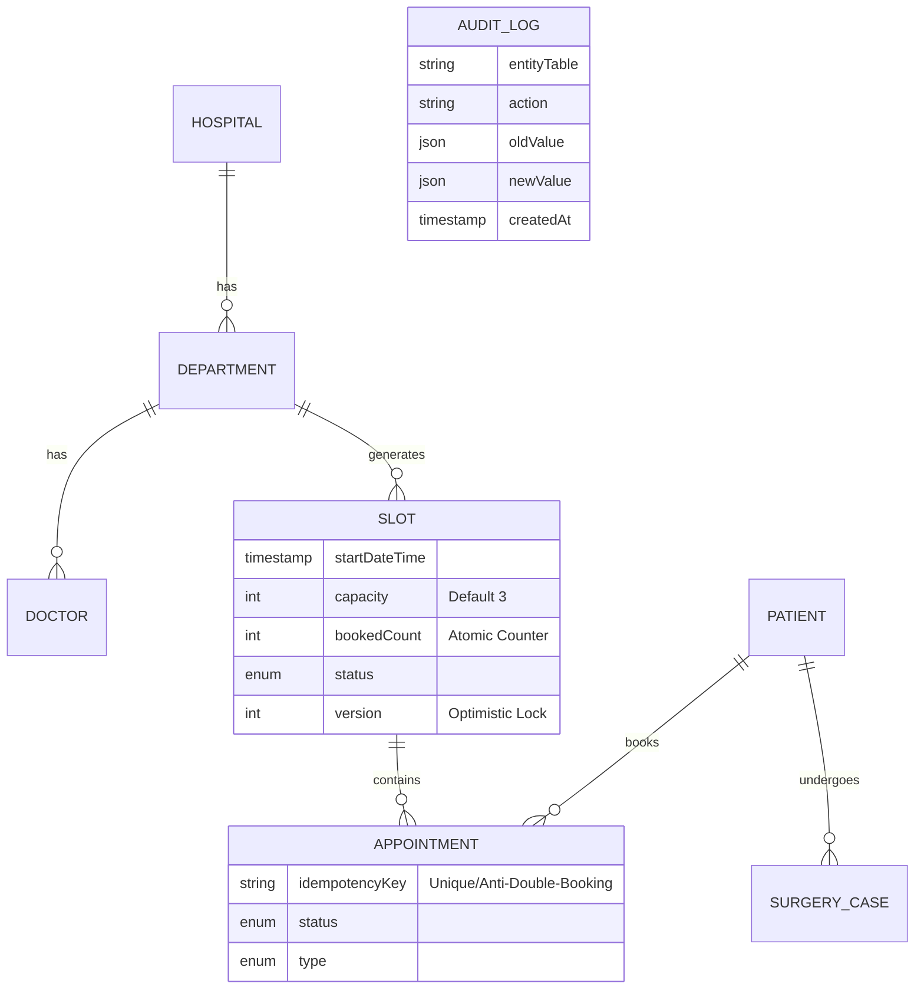

# 1. ERD / DB 설계안 (PostgreSQL 기준)

본 설계안은 [Prisma Schema](../backend/database/schema.prisma)를 기반으로 작성되었습니다.
**업데이트: "완벽한 앱" 요구사항 반영 (Audit Log, Idempotency)**

## 핵심 엔티티 구조 변경점

### 1. Appointment (외래 예약) - 강화됨
- **`idempotencyKey`**: 클라이언트(앱)에서 결제/예약 요청 시 생성한 고유 키를 저장합니다. 네트워크 오류로 인한 **중복 예약 요청을 DB단에서 원천 차단**합니다 (Unique Constraint).

### 2. AuditLog (감사 로그) - 신규
병원 운영의 투명성을 위해 주요 데이터 변경 이력을 모두 저장합니다.
- **`entityTable`**: 변경된 테이블명 (예: Appointment)
- **`entityId`**: 변경된 데이터의 ID
- **`action`**: CREATE, UPDATE, CANCEL 등
- **`actorId`**: 변경을 수행한 직원 ID (시스템 자동인 경우 null)
- **`oldValue` / `newValue`**: 변경 전후 데이터 (JSON 형태 저장)

---

## 데이터 모델 다이어그램 (Textual ERD)

